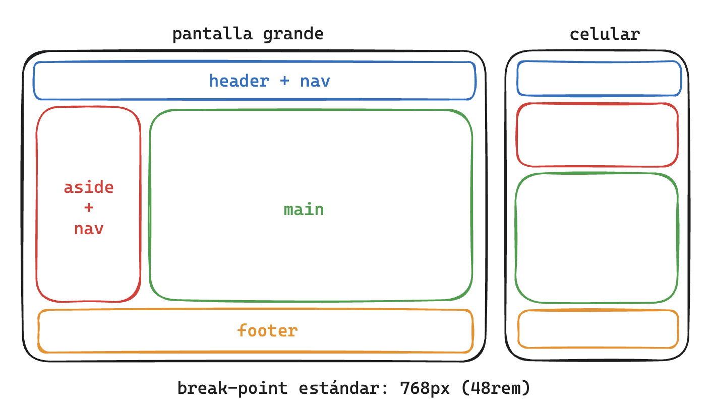

# Laboratorio 03: CSS Layout con Grid

En este tercer laboratorio de tu **Product Landing Page**, aplicaremos los conocimientos debatidos en la sesión anterior sobre **CSS Grid**, a la que en este documento nos referiremos como “grilla”. A lo largo de la práctica, seguirás consolidando la base de accesibilidad y semántica que construiste en laboratorios previos y, ahora, crearás **un layout dinámico** con **barra superior (navbar)** y **barra lateral (sidebar)**, especialmente para las nuevas páginas de “Testimonios” y "Comprar".

> ⏱️ **Checkpoints**: Este laboratorio incluye tres momentos de validación grupal (aprox. a los 30, 50 y 80 minutos). Participar activamente en ellos te permitirá intercambiar criterios con tus compañeros e instructor, reforzando la conexión entre la **Lectura y Debate** y la **Implementación Práctica**.

## 🎯 Objetivos de Aprendizaje

1. Comprender la esencia de CSS Grid
2. Diseñar Layouts complejos y responsivos con Grid
3. Aplicación en un escenario real

## 🔑 Conceptos Clave

- **Contenedor y Elementos Grid**  
- **Filas, Columnas y Áreas**  
- **Espaciado y Alineación**  
- **Responsividad y Adaptabilidad**

## ⚙️ Setup Inicial

1. **Repositorio**  
   - Continúa trabajando en tu mismo repositorio local.  
   - Asegurate de tener actualizado el repositorio con `git pull`.

2. **Archivos y Estructura**  
   Tu proyecto debería lucir así:
   ```
   product-landing-page/
   ├── index.html
   ├── testimonios.html  <-- nueva página de testimonios
   ├── compra.html  <-- nueva página de compra
   ├── css/
   │   └── styles.css
   ├── img/
   └── README.md
   ```

## 📋 Historias de Usuario

1. **HU1: Página de Testimonios**  
   > *"Como usuario, deseo ver una página aparte de testimonios organizada en una grilla con una **barra superior** (navbar) y un **sidebar** de filtros, para poder navegar y filtrar los comentarios fácilmente."*  
   - **Criterios de Aceptación**:  
     - Barra superior fija (o anclada) en la parte superior de la página.  
     - Sidebar a la izquierda en pantallas grandes y reacomodado debajo del navbar en pantallas pequeñas.  
     - Sección central que muestre los testimonios de forma clara (tarjetas o lista).  
     - El DOM debe mantener una estructura semántica (nav, aside, main).  

2. **HU2: Página de Compra**  
   > *"Como cliente, necesito acceder a una página de compra que incluya un layout con navbar y sidebar, para conocer los detalles del producto y finalizar mi adquisición de manera intuitiva."*  
   - **Criterios de Aceptación**:  
     - Navbar en la parte superior para la navegación general.  
     - Sidebar con opciones o pasos de compra (e.g., selección de variantes, cálculo de envío, métodos de pago), aunque no sean funcionales aún.  
     - Sección principal para mostrar el resumen del producto y un formulario o botón para completar la compra (simulado).  
     - Responsividad: en pantallas pequeñas, el sidebar se reubica para no dificultar la visualización principal.  

3. **HU3: Layout Responsivo en Todas las Páginas**  
   > *"Como usuario que navega desde un teléfono, quiero que **todas las páginas del sitio** se adapten al ancho de mi dispositivo, evitando el scroll horizontal y manteniendo la accesibilidad."*  
   - **Criterios de Aceptación**:  
     - Uso de CSS Grid con breakpoints (media queries) para reorganizar las columnas en una sola columna cuando el ancho sea reducido.  
     - Preservar etiquetas semánticas (header, nav, main, aside, footer, etc.) y atributos de accesibilidad (`alt` en imágenes, roles si aplican).  
     - El contenido debe conservar márgenes o espacios adecuados (`gap`, `padding`) que faciliten la lectura y la interacción en pantalla pequeña.

## Wireframes de referencia



## ☑️ Requerimientos Técnicos

1. **Uso de CSS Grid en Todas las Páginas:**  
   - Cada página (incluyendo la principal, la de testimonios y la de compra) debe implementar un contenedor con `display: grid;` para organizar la barra superior, la barra lateral y la sección central.

2. **Navbar y Sidebar Responsivos:**  
   - La barra superior (navbar) se mantendrá en la parte superior.  
   - El sidebar se ubicará a la izquierda en pantallas grandes y se reacomodará debajo del navbar en pantallas pequeñas, evitando scroll horizontal.

3. **Media Queries para Breakpoints Móviles:**  
   - Definir al menos un breakpoint que reorganice la grilla a una sola columna (o mínima cantidad de columnas) cuando el ancho de la ventana sea reducido.  
   - Ajustar tipografía, espaciados (`gap`, `padding`) y disposición para mejorar la usabilidad en dispositivos móviles.

4. **Estructura Semántica y Accesible:**  
   - Mantener etiquetas como `<header>`, `<nav>`, `<aside>`, `<main>`, `<footer>` donde corresponda, y utilizar atributos de accesibilidad (p.ej. `aria-label`, `alt` en imágenes).  
   - Verificar que la posición visual con Grid no afecte el orden lógico en el DOM para lectores de pantalla.

5. **Contenido Representativo en Testimonios y Compra:**  
   - En la página de **Testimonios**, mostrar al menos un listado o tarjetas con comentarios de usuarios y filtros simulados en el sidebar.  
   - En la página de **Compra**, incluir un resumen de producto y pasos de compra (opciones de envío, métodos de pago, etc.) para validar la coherencia del layout y la responsividad.

## ⭐️ Logros Adicionales

1. **Logro 1: Botón “Comprar” con Mensaje Predeterminado en WhatsApp**  
   - Implementar un **botón** en la página de Compra que, al hacer clic, redireccione a **WhatsApp Web** (o la app móvil) abriendo la conversación con un número predeterminado.  
   - Incluir un **mensaje inicial** automático (p. ej. “Hola, vengo desde la página de Compra y me interesa este producto.”), asegurándose de abrir el enlace en una **nueva pestaña** o ventana.

2. **Logro 2: Personalizar el Mensaje con Opciones Seleccionadas**  
   - Ajustar la **URL de WhatsApp** para que el **mensaje predeterminado** incluya las opciones elegidas en la página de Compra (por ejemplo, color, tamaño, método de envío).  
   - Permitir que el texto del botón o el mensaje se actualice dinámicamente según las variables del producto, brindando al cliente un **resumen de su selección** antes de confirmar la compra via WhatsApp.

## 📝 Instrucciones de Entrega

2. **Despliegue**  
   - Publica la nueva versión en GitHub Pages.

3. **Entrega Final**  
   - URL del repositorio  
   - URL de la página desplegada
