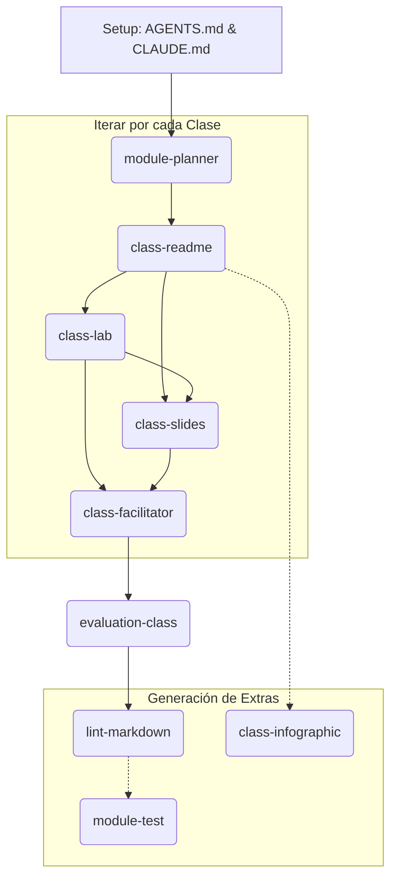

# Guía de Creación de Cursos con el Sistema de Skills

Esta guía está diseñada para instructores o creadores de contenido que desean estructurar un nuevo curso utilizando el ecosistema de *Shared Skills* (Agentes de Código). 

El sistema funciona como una **línea de ensamblaje** donde cada agente (skill) tiene un propósito específico y, a menudo, depende del trabajo del agente anterior.

---

## FASE 1: Preparación del Entorno (Setup)
Antes de llamar a cualquier agente creador de contenido, el entorno debe estar configurado para que los agentes entiendan *qué* curso están construyendo.

### 1. Archivos Fundacionales (Manuales)
> [!IMPORTANT]
> **Estos archivos no se crean con una skill.** Son el "Master Prompt" que configura el comportamiento de todos los agentes para tu curso específico. Sin ellos, los agentes no sabrán qué tipo de curso están construyendo.

Debes crear estos archivos en la raíz de tu nuevo repositorio de curso:
- **`AGENTS.md`**: Es el cerebro del contexto. Aquí defines el nombre del curso, el público objetivo (estudiantes), la densidad de los temas, la estructura de directorios esperada y las convenciones de nombrado.
- **`CLAUDE.md` / Notas del Agente**: Documenta el progreso del curso y referencia la disponibilidad de los skills.

**Estrategia Recomendada:**
1. No los escribas desde cero. **Copia** estos dos archivos de un repositorio de curso existente (ej: `code-101-guide`).
2. **Edita** los valores (nombre del curso, nivel teórico, etc.) para que coincidan con tu nuevo proyecto.

### 2. Sincronización de Skills
- Ejecutas el script de sincronización (`ets-sync-skills-win.ps1` en Windows) para crear los accesos directos (*symlinks* / *junctions*) que conectan tu repositorio vacío con la carpeta `shared-skills`.

---

## FASE 2: Planificación Arquitectónica
Una vez que el agente sabe de qué trata el curso (gracias a `AGENTS.md`), empezamos a construir la estructura general.

### Paso 1: `/module-planner`
- **¿Qué hace?**: Es el arquitecto del módulo. Toma el tema general y lo divide lógicamente (generalmente en 4 clases).
- **Precede a**: Todos los demás skills. Sin un plan, los siguientes agentes no sabrán qué contenido generar.
- **Output esperado**: Un archivo `MODULE-PLAN.md` que detalla los objetivos, temas y ejercicios propuestos para cada clase del módulo.

---

## FASE 3: Generación de Contenido por Clase
Con el `MODULE-PLAN.md` aprobado, iteramos clase por clase. El orden aquí es crucial porque el contenido teórico dicta los ejercicios, las diapositivas y cómo se enseñará.

### Paso 2: `/class-readme`
- **¿Qué hace?**: Escribe el material de estudio principal para el estudiante.
- **Precede a**: `class-lab`, `class-slides`, `class-facilitator`.
- **Output esperado**: El archivo `README.md` principal de la clase con la teoría explicada.

### Paso 3: `/class-lab`
- **¿Qué hace?**: Diseña el laboratorio práctico o "hands-on" basándose en la teoría previamente generada.
- **Requiere**: Haber ejecutado `class-readme`.
- **Output esperado**: La ruta `lab/README.md` con los retos, paso a paso y código de inicio.

### Paso 4: `/class-slides`
- **¿Qué hace?**: Resume la teoría (`class-readme`) y menciona los ejercicios (`class-lab`) para crear presentaciones (ej. formato reveal.js).
- **Requiere**: Haber ejecutado `class-readme` y `class-lab`.
- **Output esperado**: La ruta `slides/README.md` u otro formato de presentación.

### Paso 5: `/class-facilitator`
- **¿Qué hace?**: Crea la guía privada para el profesor. Le indica cómo dar la clase, qué preguntas hacer, dónde los alumnos suelen equivocarse en los laboratorios y los tiempos sugeridos.
- **Requiere**: Todos los anteriores de la clase. Necesita conocer la teoría, las diapositivas y el laboratorio para aconsejar al profesor.
- **Output esperado**: La ruta `facilitator/README.md`.

---

## FASE 4: Validación y Pulido
Antes de publicar el contenido, pasa por agentes de control de calidad.

### Paso 6: `/evaluation-class`
- **¿Qué hace?**: Actúa como un auditor académico. Revisa que el contenido cumpla con los estándares pedagógicos definidos en el bootcamp y que haya coherencia entre la teoría y el laboratorio.
- **Output esperado**: Un reporte de auditoría directamente en la conversación (o archivo de revisión) con sugerencias de mejora.

### Paso 7: `/lint-markdown`
- **¿Qué hace?**: Es el auditor técnico. Revisa que todos los archivos Markdown estén bien formateados, que los enlaces no estén rotos y sean compatibles con plataformas como GitHub Pages.
- **Output esperado**: Correcciones directas a los archivos `.md`.

---

## FASE 5: Recursos Adicionales e Instrumentos de Medición
Una vez que el módulo o clase está empaquetada, se generan los accesorios.

### Paso 8: `/class-infographic`
- **¿Qué hace?**: Genera un recurso visual (HTML/CSS) post-clase para que los estudiantes compartan o repasen rápidamente los conceptos clave.
- **Requiere**: Haber completado el contenido teórico (`class-readme`).
- **Output esperado**: `infographic/index.html` e imágenes base.

### Paso 9: `/module-test`
- **¿Qué hace?**: Al finalizar de construir un módulo completo (ej. las 4 clases), genera el examen diagnóstico o quiz para medir el aprendizaje de todo ese bloque.
- **Requiere**: Todas las clases del módulo completadas.
- **Output esperado**: `test/README.md` o formato de banco de preguntas.

---

## Diagrama de Flujo (Resumen)

> [!TIP]
> **Para un curso nuevo:** Enfócate primero en perfeccionar tu `AGENTS.md`. Si el agente principal no tiene un buen contexto fundacional, los demás skills (desde el planner hasta los tests) generarán contenido genérico o desalineado.
